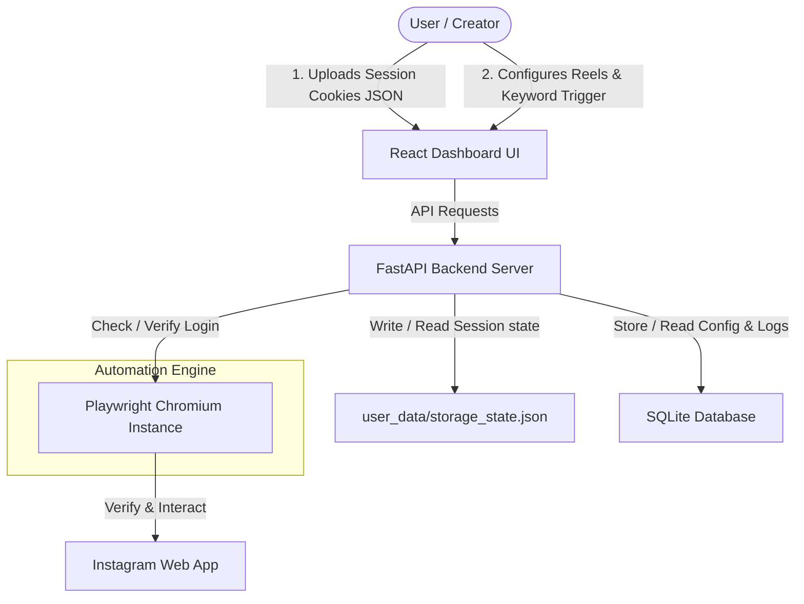
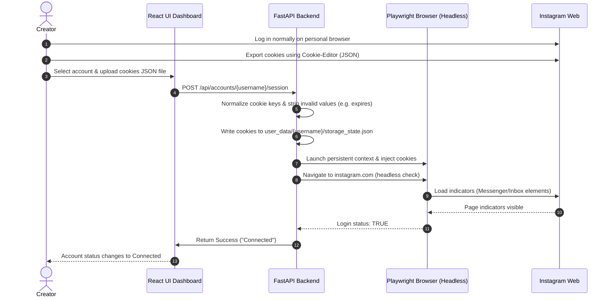
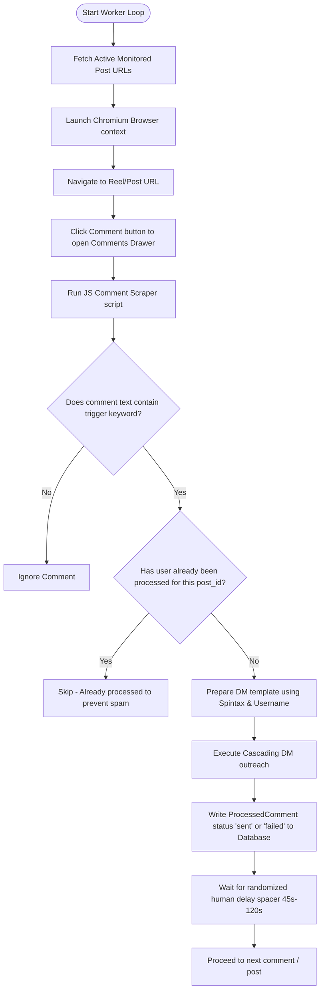
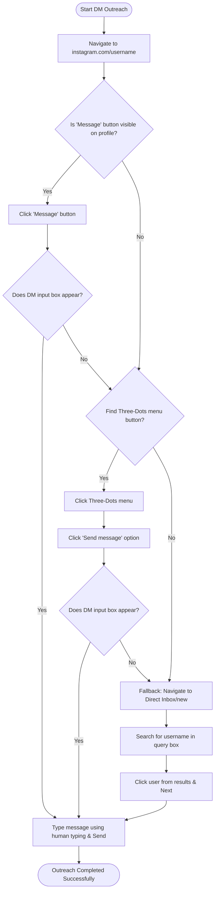

<p align="center">
  
</p>

<h1 align="center">Instagram Auto DM Bot</h1>

<p align="center">
  <strong>Automate Instagram direct messages with intelligent comment-triggered outreach and passwordless cookie authentication</strong>
</p>

<p align="center">
  
  
  
  
  
</p>

<p align="center">
  <a href="https://insta-auto-dm-bot-nlr.vercel.app">Live Dashboard</a>
</p>

---

## 📖 Overview

A premium, full-stack Instagram DM automation platform designed to manage and scale comment-triggered messaging campaigns. Clients can securely connect their Instagram profiles **without sharing passwords** by uploading standard session cookies JSON. 

The backend runs a headless **Playwright** worker loop simulating organic human interaction to monitor posts, detect keywords, and dispatch direct messages via multiple fallback routing strategies.

> [!IMPORTANT]
> **Passwordless Security:** This bot does not prompt for, store, or transmit Instagram account passwords. It operates entirely using browser-exported session cookie contexts, keeping your accounts safe and compliant with client security policies.

---

## 🗺️ System Flow & Architecture



---

## 🔒 Passwordless Session Cookie Authentication Flow

To keep client accounts secure, creators simply log in on their personal browser and export cookies using extensions like *EditThisCookie* or *Cookie-Editor*. The backend sanitizes, validates, and runs them headlessly.



---

## 🤖 Comment-to-DM Trigger Flow

The background worker continuously monitors Reels/posts, checks comments against target keywords, deduplicates them against database history to prevent spamming, and dispatches messages with random intervals.



---

## 🛡️ Cascading DM Delivery Strategy

Instagram UI varies depending on whether a target account is public, private, or has restrictions. The bot employs a robust three-tier cascading outreach pipeline to ensure maximum deliverability:



---

## ⚡ Key Capabilities

* **Resilient Page Navigation** — Scrapers use `domcontentloaded` wait states and ignore external heavy media timeouts to ensure fast execution and reduce page crashes.
* **Auto-Recovery Login Checks** — If Instagram is slow or times out, the bot keeps the account status as `connected` and retries, rather than immediately marking it as invalid.
* **Double-Thread Prevention** — The API prevents parallel bot worker loops by checking if a thread is already running, avoiding browser session profile lock conflicts.
* **Database Clean Integrity** — Deleting a monitored post deletes its associated comment history using SQLite foreign key cascade constraints (`PRAGMA foreign_keys = ON`), resolving post ID reuse issues.
* **Spintax & Dynamic Replaces** — Vary your outreach text naturally with `{Hello|Hi|Hey} {username}` templates.

---

## 🚀 Getting Started

### Prerequisites
* **Python 3.10+**
* **Node.js 18+**
* **Git**

### 1. Clone the Repository
```bash
git clone https://github.com/NLR-2007/insta-auto-dm-bot-nlr.git
cd insta-auto-dm-bot-nlr
```

### 2. Backend Setup
```bash
# Create and activate virtual environment
python -m venv venv
venv\Scripts\activate # On Windows

# Install dependencies and browsers
pip install -r backend/requirements.txt # or install fastapi uvicorn sqlalchemy pydantic-settings playwright
playwright install chromium

# Start the backend server
python -m uvicorn backend.main:app --reload --port 8000
```

### 3. Frontend Setup
```bash
cd frontend
npm install
npm run dev
```

---

## ⚙️ Configuration (`.env`)

```env
DATABASE_URL=sqlite:///./insta_automate.db
HEADLESS=false
DAILY_DM_LIMIT=30
MIN_DELAY_SECONDS=45
MAX_DELAY_SECONDS=120
```

---

## 📈 Tech Stack

| Layer | Technology |
|-------|------------|
| **Frontend** | React 19, Vite 8, TailwindCSS / Vanilla CSS, Lucide Icons |
| **Backend** | Python, FastAPI, SQLAlchemy, Pydantic |
| **Automation** | Playwright (Chromium) |
| **Database** | SQLite (default) / MySQL |
| **Deployment** | Vercel (frontend), Local Machine / VPS (backend) |

---

<p align="center">
  Developed by <strong>NLR GROUP OF COMPANIES</strong>
</p>

<p align="center">
  <a href="https://nlrgroupofcompany.in">nlrgroupofcompany.in</a>
</p>
